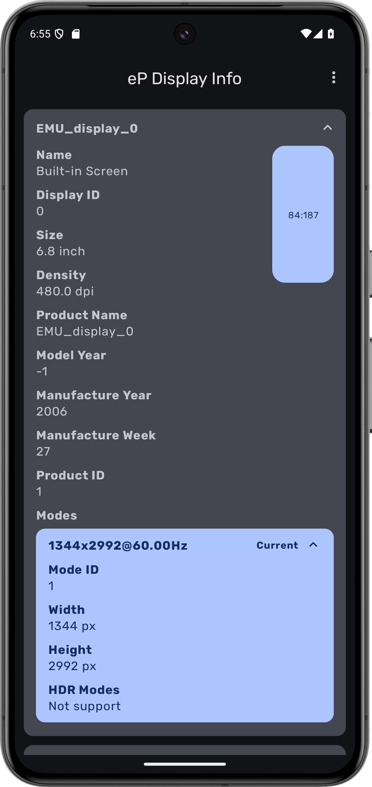
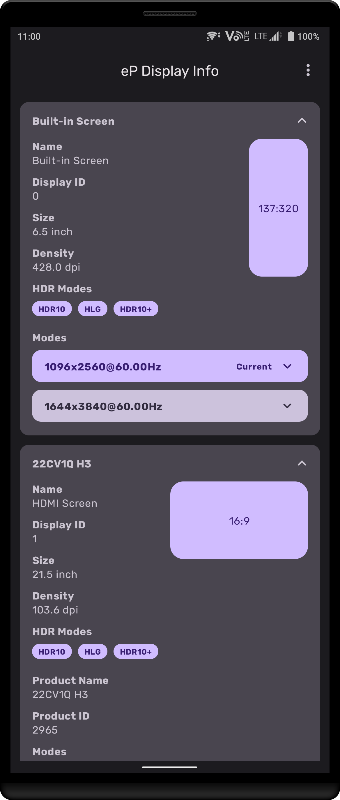

# eP Display Info

# Introduction
eP Display Info is a tool to view information of displays on your Android device. 
This app will update display information automatically when there are new display plugging in.

# Features
* Get the display size, name, supported modes and so on.
* Get the manufacture information of display. 
(Android 11 requires some ugly method to get this because some API was opened after Android 12)

# Requirements
* System: Android 11 or newer version.

## Screenshots

