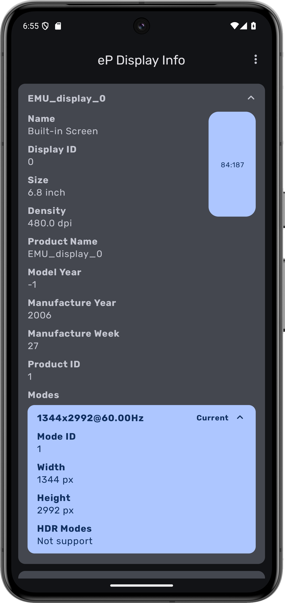
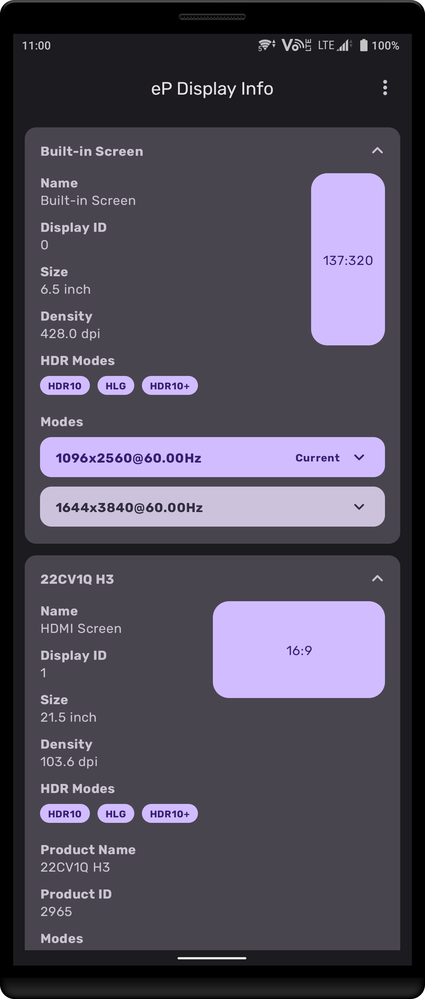
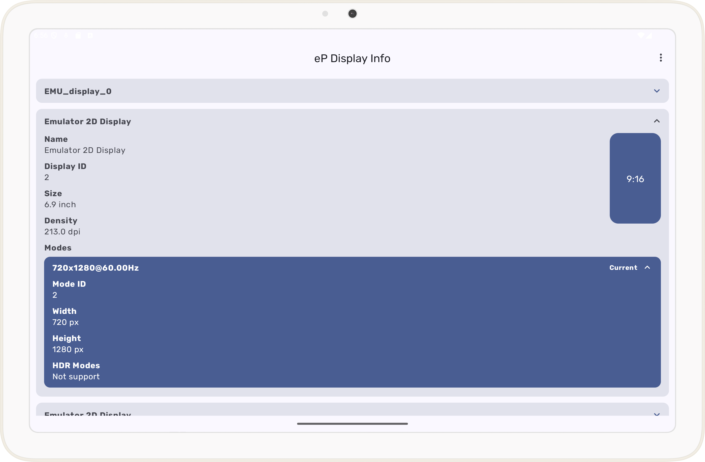

# eP Display Info
[English](Readme.md) [繁體中文](Readme_tc.md)
# 介紹
eP Display Info是一款能夠顯示你Android裝置上螢幕資訊的軟體，能在有新顯示器連接時自動更新螢幕資訊。

# 功能
* 取得螢幕大小、名稱與支援模式等
* 取得螢幕製造資訊 
(相關API在Android 12才開放，故Android 11 上需要使用較爲醜陋的做法。)

# 系統需求
* 系統: Android 11 或更新版本.

## Screenshots

 
